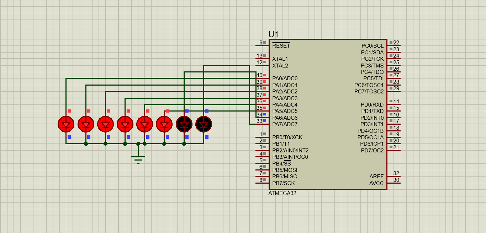
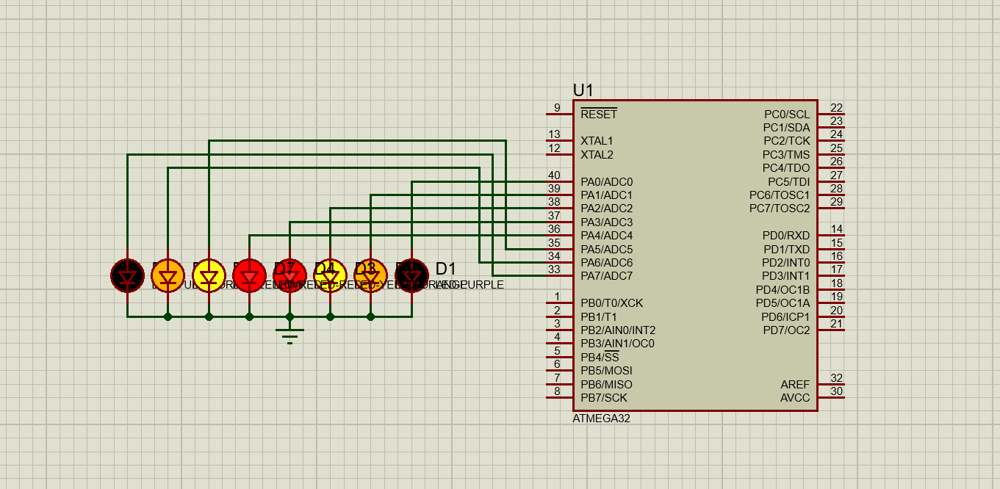

# LED Patterns with AVR ATmega32

This repository contains two projects for creating LED patterns using an AVR ATmega32 microcontroller. The code for both projects is written in C and tested using the Proteus simulator. The development is done using Eclipse IDE.

## Project 1: Snake Effect

### Description
This project demonstrates a "snake" effect on 8 LEDs connected to PORTA of the ATmega32 microcontroller. The LEDs light up one by one and then turn off one by one, creating a moving snake effect.

### Usage
1. Compile the code using your preferred AVR toolchain.
2. Load the hex file into the ATmega32 microcontroller.
3. Observe the snake effect on the 8 connected LEDs.

### Screenshot

## Project 2: Inward-Outward Snake Effect

### Description
This project creates an "inward-outward" snake effect on 8 LEDs connected to PORTA of the ATmega32 microcontroller. The LEDs light up from the outside to the center and then turn off in the same manner, creating a symmetrical pattern.

### Usage
1. Compile the code using your preferred AVR toolchain.
2. Load the hex file into the ATmega32 microcontroller.
3. Observe the inward-outward snake effect on the 8 connected LEDs.

### Screenshot

## Development Environment

- **Microcontroller**: AVR ATmega32
- **IDE**: Eclipse
- **Simulator**: Proteus

## Demo

## Author

Islam Gomaa

Feel free to contribute or provide feedback on this project!
